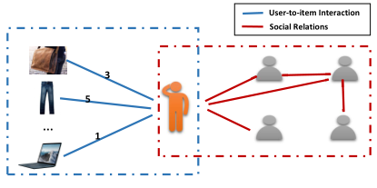
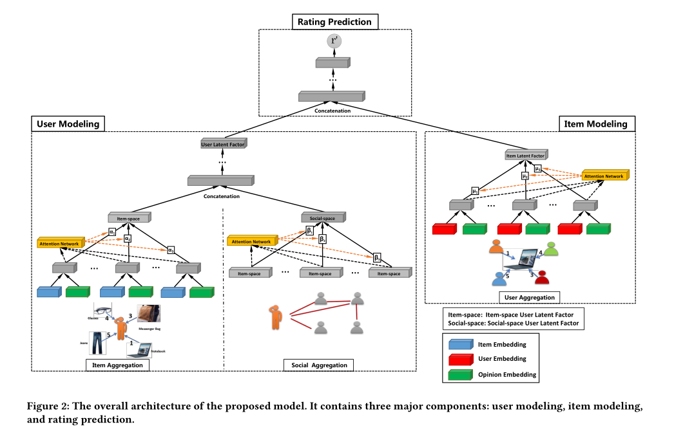

## 引言

- GNNs（Graph Neural Networks）在图数据的学习上具有很强大的功能，能够naturally整合图的节点信息和图的连接信息
- 社交推荐系统可以被表示为user-user graph和user-item graph，用户隐含向量和商品隐含向量的学习是社交推荐的关键

## 挑战

- user-user graph中，社交关系有不同的强度，比如有的朋友关系不是很密切，有的朋友关系比较好，这就导致了不同的朋友会对用户产生不同的影响

- user-item graph中，同时编码了用户和商品的关系以及用户对商品的评分

- 用户既包含在user-item图中，又包含在user-user图中

  

## 解决问题

给定用户评分矩阵R（nxm，n个用户m件商品）和用户社交关系矩阵S（nxn），要求预测每个用户在R中缺失的评分

## 主要观点

提出了GraphRec模型，来构建社交推荐系统完成评分预测（Rating Predication）的任务。

具体的：

根据上图可知，在编码商品隐含向量（item latent factor）时，将购买过该商品的用户向量和用户对该商品的评分向量结合作为新的用户向量①（从另一个角度理解就是为了估计中心节点的信息，需要整合与之相邻的节点和边的信息--就商品隐含向量而言），然后对该新的用户向量应用注意力机制（Attention Networks）最后得到商品隐含向量

作者在编码用户隐含向量的时一部分和编码商品隐含向量类似，另一部分则是抽取用户的社交网络，利用注意力机制挑选出和用户社交关系强的用户向量Item-space作为这部分的向量表示，然后将两部分拼接在一起作为用户的隐含向量

最后将用户隐含向量和商品隐含向量相乘就得到用户对某商品的评分

## 数据集

Epinion

Ciao

## 评估

MAE（mean absolute error）

RMSE（root mean square error）

[参考资料链接]: https://zhuanlan.zhihu.com/p/73739655

